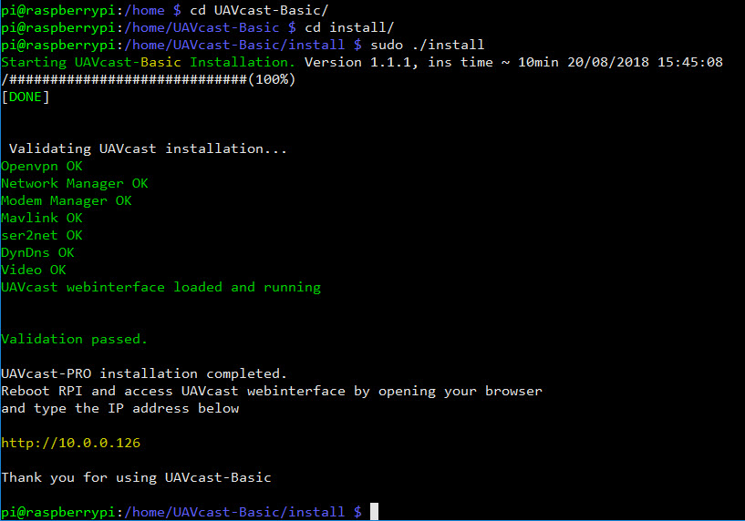

# Installation

##Raspberry Pi Image

Start with a fresh Raspberry image, you find images at [raspberry.org](https://www.raspberrypi.org/downloads/) site.
UAVcast works on several images, such as:

* Raspian Lite
* Raspian Desktop

Follow the installation instruction given on their site for the specific image you want to use.

##UAVcast-Pro installation

!!! tip
    For the Basic version, just change the **Pro** with **Basic** in the below instructions.

For UAVcast Pro, you will get a download link by mail after you have purchased the product.
You need to copy the xx.tar file to your raspberry pi.

* If you are using **Desktop** image, then just open a terminal window and follow the instruction below.
* For **non-desktop** images, you can use SSH client like [Bitevise tunnelier](https://dl.bitvise.com/BvSshClient-Inst.exe) to establish connection to raspberry pi.

Open a shell or terminal window and navigate to the same folder as you saved the file, normally ``home/pi`` or `home/pi/Download`
then you need to extract the package by using typing this command `sudo -tar UAVcast-Pro_vx.x.x.tar`

Now you need to navigate to the UAVcast-Pro installation folder
`cd UAVcast-Pro/install`

then start the installation by typing `sudo ./install`
Installation time is approx 10min on a RPI version 3

When the installation is complete, it will run a validation check, please make sure that you have all green OK status.
Now you are able to connect UAVcast-Pro by typing the RPI ip in your web browser.

**Installation video** can be found here
[https://drive.google.com/file/d/1tbuUO63gU0by81wyijbuWI1duRYaILXS/view?usp=sharing](https://drive.google.com/file/d/1tbuUO63gU0by81wyijbuWI1duRYaILXS/view?usp=sharing)

!!! tip
    If you are installing UAVcast-Pro version 1.1.0 or older, you need to place UAVcast-Pro_v1.x.x.tar in home/pi, otherwise it will not work. 
    Version 1.1.1 or later supports global install can be installed from anywhere

